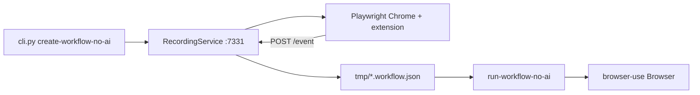

# workflow-use Local Pilot

Goal: **human teach** a workflow, then **replay with custom params** (zero LLM on hot path).

## Directory layout

```
browser-automation-pilot/
  workflow-use/          # main repo (extension + workflows CLI)
  browser-use/           # reference clone (runtime via pip in .venv)
  README.md
  PILOT.md               # this file
  scripts/
    pilot-env.sh         # UTF-8 + env helpers for Git Bash
```

## Prerequisites (your machine)

| Tool | Status |
|------|--------|
| Python 3.12 | OK |
| Node 24 + npm | OK |
| uv | OK |
| Git Bash | OK |

## One-time setup (done unless you re-clone)

```bash
# 1) Extension (required for recording)
cd "C:/Users/gamin/Desktop/NAVA CODE/browser-automation-pilot/workflow-use/extension"
npm install && npm run build
# → extension/.output/chrome-mv3/

# 2) Python env
cd "../workflows"
uv sync
uv pip install playwright          # not always pulled transitively on Windows
uv run python -m playwright install chromium

# 3) Env file (optional for NLP/heal; not needed for create-workflow-no-ai + run-workflow-no-ai)
cp .env.example .env
# For heal/NLP later: OPENAI_API_KEY or wire xAI via browser-use ChatOpenAI
```

## Windows gotcha: UTF-8 console

browser-use logs emojis; Windows `cp1252` breaks semantic extraction.

**Before any CLI run in Git Bash:**

```bash
export PYTHONUTF8=1
export PYTHONIOENCODING=utf-8
# optional: chcp 65001
```

Or use `scripts/pilot-env.sh`.

## Pilot A — Replay first (no teach, ~5 min)

Validates Playwright + replay path before you record anything.

```bash
source "C:/Users/gamin/Desktop/NAVA CODE/browser-automation-pilot/scripts/pilot-env.sh"
cd "C:/Users/gamin/Desktop/NAVA CODE/browser-automation-pilot/workflow-use/workflows"

mkdir -p tmp
cp examples/workflows/parameterized/github_stars_parameterized.workflow.json.bak tmp/github_stars.workflow.json

# When prompted for repo_name, enter: browser-use/browser-use
uv run python cli.py run-workflow-no-ai tmp/github_stars.workflow.json
```

**Success:** browser opens, GitHub loads, search runs, star count extracted.

**If semantic mapping fails (0 elements):** UTF-8 env missing — set `PYTHONUTF8=1` and retry.

## Pilot B — Human teach + replay (~15 min)

### 1. Record (headed Chrome + extension)

```bash
source scripts/pilot-env.sh   # from browser-automation-pilot/
cd workflow-use/workflows
uv run python cli.py create-workflow-no-ai
```

What happens:
1. Local server starts on `127.0.0.1:7331`
2. **Playwright** opens headed Chrome with the recorder extension (not browser-use agent CDP)
3. **Open the extension:** puzzle icon → **browser-use-workflow-recorder** → side panel opens
4. Click **Start recording** in the side panel, perform your workflow
5. Click **Stop recording** in the side panel (or close Chrome)
6. CLI saves `tmp/*.workflow.json` and exits (no hang if you close browser without recording)

**Suggested first teach target (not Infor yet):**
- https://example.com — trivial smoke test
- https://www.saucedemo.com — login + add to cart (parametrize username later)

### 2. Parameterize (optional)

Edit saved `.workflow.json`:
- Add `input_schema` with field names
- Replace hardcoded values with `{field_name}` in step `value` / `target_text`

See `examples/workflows/parameterized/github_stars_parameterized.workflow.json.bak`.

### 3. Replay

```bash
uv run python cli.py run-workflow-no-ai tmp/your_workflow.workflow.json
# enter param values when prompted
```

Replay uses the **same pilot Chrome profile** as recording (`workflow_use/recorder/user_data_dir`), so logins persist. Override with `RECORDER_USER_DATA_DIR` in `scripts/pilot-env.sh`.

### 4. Programmatic replay (API-shaped)

```python
import asyncio
from browser_use import Browser
from browser_use.llm import ChatOpenAI
from workflow_use.workflow.service import Workflow

async def main():
    workflow = Workflow.load_from_file(
        "tmp/your_workflow.workflow.json",
        llm=ChatOpenAI(model="grok-4.3", base_url="https://api.x.ai/v1", api_key="..."),
        browser=Browser(),
    )
    result = await workflow.run_with_no_ai(inputs={"guest_name": "Test Guest"})
    print(result)

asyncio.run(main())
```

`llm` required by constructor but **not used** for interactions in `run_with_no_ai`.

## Pilot C — Infor HMS (when IT gives access)

Same flow as Pilot B on Infor UAT URL:
1. Log in once during **record** (pilot profile keeps the session for **replay**)
2. `create-workflow-no-ai` for lookup or create-reservation
3. Parameterize `input_schema` to mirror Infor API fields
4. `run-workflow-no-ai` for cheap replays

## Key CLI commands

| Command | Purpose |
|---------|---------|
| `create-workflow-no-ai` | **Human teach** → semantic workflow (use this) |
| `create-workflow` | Human teach + AI-assisted build |
| `run-workflow-no-ai` | **Deterministic replay** (use this) |
| `run-workflow` | Replay with LLM-assisted steps |
| `generate-workflow "..."` | NLP teach (skip for now) |
| `launch-gui` | Visual workflow manager |

## Architecture (how recording works)



Recording uses **Playwright** only (stable extension host). Replay still uses **browser-use**.

Extension path hardcoded in `workflow_use/recorder/service.py`:
`extension/.output/chrome-mv3` — **must run `npm run build` after clone.**

## Linux / Ubuntu EC2 (xRDP)

1. Clone: `git clone https://github.com/kufupa/nava-workflow-pilot.git`
2. Setup: `bash scripts/setup-linux.sh`
3. Connect via SSM tunnel + RDP (`localhost:3390`)
4. **Run record/replay from the xRDP desktop terminal** — not headless SSM (needs `DISPLAY`)
5. `bash scripts/record.sh` → teach → `bash scripts/replay.sh workflow-use/workflows/tmp/<file>`

| Issue (Linux) | Fix |
|---------------|-----|
| Chrome won't start | Run from xRDP terminal; check `echo $DISPLAY` |
| Chrome sandbox crash | Pilot uses `--no-sandbox` on Linux automatically |
| `Extension directory not found` | `bash scripts/setup-linux.sh` |

## Troubleshooting

| Issue | Fix |
|-------|-----|
| `Extension directory not found` | `cd extension && npm run build` |
| Don't see extension UI | Puzzle icon → **browser-use-workflow-recorder** → side panel |
| `Page.enable` / CDP errors during record | Fixed in pilot — re-pull; recorder no longer uses browser-use for teach |
| Script hangs after closing browser | Fixed — session always signals completion |
| `No module named playwright` | `uv pip install playwright` in `workflows/` |
| `0 elements` / charmap errors | `export PYTHONUTF8=1` |
| CLI asks for BROWSER_USE_API_KEY on import | Press `n` or set key; not needed for no-ai path |
| Recording empty | Click **Start recording** in side panel; perform actions; click **Stop** (flushes workflow) |
| No workflow saved | Terminal should show `WORKFLOW_UPDATE` then `RECORDING_STOPPED` before exit |
| Replay asks to log in again | Record and replay must use same profile; check `Using pilot browser profile:` in CLI output |

## What we did NOT clone

- **Playwright** — pip package, not a git repo
- **Imprint** — separate pilot path; not needed for workflow-use test
