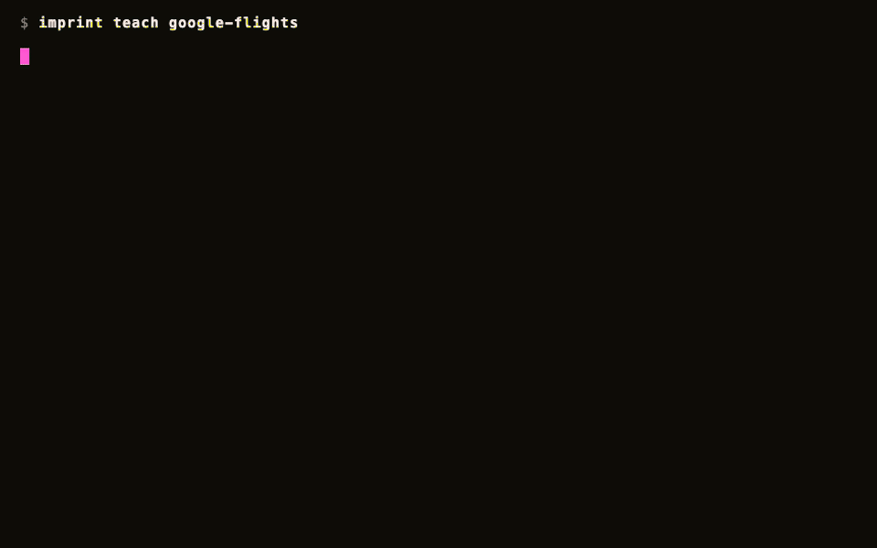

<div align="center">

# imprint

**Teach your AI agent any website. Once.**

Record a real browser session, get a deterministic MCP tool back.\
No tokens burned on exploration. No "the LLM clicked the wrong button."\
The recording *is* the executable.

[](https://github.com/ashaychangwani/imprint/actions/workflows/test.yml)

[](https://github.com/ashaychangwani/imprint/releases)
[](LICENSE)
[](https://github.com/ashaychangwani/imprint/stargazers)

[Quick Start](#quick-start) · [Examples](#examples) · [How It Works](#how-it-works) · [Docs](docs/getting-started.md)

</div>

---

## Quick Start

```bash
bun install -g imprint-mcp
imprint teach southwest --url https://www.southwest.com
```

A browser opens. You drive the workflow and narrate what you're doing. Imprint records every request and interaction, then compiles a deterministic **MCP tool** your agent can call forever.

Want to try a finished MCP before recording anything?

```bash
imprint install google-flights --source examples --platform claude-desktop
```

That registers the checked-in Google Flights example as an MCP server in your client. Swap `claude-desktop` for `claude-code`, `codex`, `openclaw`, or `hermes`, or add `--print` to see the config without changing anything.

On a Hermes agent or Docker host, register the examples directly into Hermes:

```bash
for site in google-flights google-hotels southwest discoverandgo echo; do
  imprint install "$site" --source examples --platform hermes --no-interactive
done
```

When `HERMES_HOME` is set, Imprint writes Hermes MCP entries to `$HERMES_HOME/config.yaml`; outside Hermes it uses `~/.hermes/config.yaml`. For browser-backed MCPs, `imprint install` also installs Playwright Chromium into `$HERMES_HOME/.cache/ms-playwright` and writes `PLAYWRIGHT_BROWSERS_PATH` into the MCP config so Hermes can find it. Use `--skip-browser-install` only for offline builds where you preinstall the browser yourself. In a fresh Linux image that is missing browser system libraries, install those during image build with `bunx playwright install --with-deps chromium`.

---

## See It in Action

**Teach once.** `imprint teach google-flights` records one real search and compiles a **4-tool** MCP server from that single session — the compile agent reverse-engineers Google's `batchexecute` wire format itself and wires the search→booking token chain, with no hand-written request code. Here is the actual run (6 recordings → 4 tools, every tool live-verified):



**Then your agent calls those tools** like any other — real-time results through a live trusted-Chrome (`cdp-replay`) backend:

```
$ claude "cheapest nonstop SJC→SAN the first week of July, with a carry-on"

  Alaska     AS1623   SJC→SAN   6:00a→7:32a   nonstop   $137
  Southwest  WN2412   SJC→SAN   8:15a→9:45a   nonstop   $158
  Delta      DL2901   SJC→SAN   7:10a→8:44a   nonstop   $169
```

The suite was one-shot compiled from one recording and audited at **92.6%**, every tool live-verified. *(The terminal above is a faithful replay — regenerate/record it with `bun scripts/demo-teach.ts`.)*

---

## How It Works

<table>
<tr>
<td align="center" width="33%">
<h3>1. Teach</h3>
<p>Open a real browser, drive the workflow, narrate what you're doing. Imprint records every network request and DOM interaction.</p>
</td>
<td align="center" width="33%">
<h3>2. Compile</h3>
<p>Generates two replay artifacts:<br><br><code>workflow.json</code> — API-level replay<br><code>playbook.yaml</code> — DOM-level fallback<br><br>Credentials are redacted automatically.</p>
</td>
<td align="center" width="34%">
<h3>3. Use</h3>
<p>A typed MCP tool your agent calls like any other tool. Works with Claude Code, Codex, Claude Desktop, and any MCP client.</p>
</td>
</tr>
</table>

> [!TIP]
> All three steps happen in a single `imprint teach` command. Credentials and PII are redacted automatically before anything reaches the LLM.

---

## Why Imprint?

Other browser-tool frameworks ask the LLM to **decide every click at runtime**. Imprint takes a fundamentally different approach:

| | **Imprint** | **browser-use / Computer Use** |
|:--|:--|:--|
| **Approach** | Record once, replay deterministically | LLM decides every click at runtime |
| **Token cost** | Zero at runtime | Scales with workflow complexity |
| **Reliability** | Deterministic — same input, same output | Variable — exploration can diverge |
| **Bot detection** | Real Chromium + stealth-fetch | Detectable automation fingerprint |
| **Fallback** | Automatic ladder (API → DOM) | None |
| **Speed** | 200ms – 9s | 30s+ |

---

## Installation

### Recommended

```bash
bun install -g imprint-mcp
```

> Requires [Bun](https://bun.sh) >= 1.3. Or run without installing: `bunx imprint-mcp teach <site> --url <url>`

### Standalone Binary

```bash
curl -fsSL https://raw.githubusercontent.com/ashaychangwani/imprint/main/scripts/install.sh | bash
```

### From Source

```bash
git clone https://github.com/ashaychangwani/imprint.git && cd imprint
bun install && bun link
```

<details>
<summary><strong>Browser setup & LLM providers</strong></summary>

<br>

**Browser commands** (`teach`, `record`, `login`, `playbook`) and browser-backed `imprint install` targets auto-install Playwright Chromium when it is missing. For offline CI or prebuilt Linux images where you pass `--skip-browser-install`, preinstall it ahead of time:

```bash
bunx playwright install chromium
```

**LLM providers** are auto-detected. Run `imprint doctor` to see what's available.

| Priority | Provider | Detected via |
|:--|:--|:--|
| 1 | Claude Code | `claude` on PATH |
| 2 | Codex CLI | `codex` on PATH |
| 3 | Anthropic API | `ANTHROPIC_API_KEY` env var |
| 4 | Cursor | `cursor` on PATH |

Override with `--provider <name>` and `--model <name>`.

</details>

---

## The Backend Ladder

When an API call gets blocked, Imprint doesn't jump to DOM replay. It escalates through the cheapest backend that works:

```
  fetch            ~200ms    Plain APIs, persisted cookies
    │
    ▼
  fetch-bootstrap  browser   Mints cookies, CSRF tokens, storage
    │               + API
    ▼
  cdp-replay       ~2-35s    API calls run inside a live, trusted Chrome —
    │                        a protected POST refreshes its anti-bot token
    │                        between calls (multi-step state-changing flows)
    ▼
  stealth-fetch    ~1-12s    Defeats Akamai, Cloudflare, DataDome
    │
    ▼
  playbook         ~9s       Full DOM replay — universal fallback
```

The full order is `fetch → fetch-bootstrap → cdp-replay → stealth-fetch → playbook`; `auto` mode walks it and stops at the first backend that works.

For bot-protected sites, `imprint probe-backends <site> --tool <toolName>` writes a `backends.json` preference cache so cron and MCP start from the known-good backend instead of rediscovering blocked rungs. Use `imprint probe-backends <site> --all` to refresh every tool in a multi-tool site; `imprint mcp status` reports stale or invalid backend caches before they quietly fall back to the default ladder. CDP replay records both cold and warm timings when it succeeds: a timeout-safe cold start may rank by its fast warm runtime, but a cold start above the preferred threshold stays behind cold-safe backends in durable cache order.

Every recording compiles to *both* `workflow.json` and `playbook.yaml`, so the ladder always has a DOM fallback.

---

## Platform Support

At the end of `imprint teach`, pick your AI platform and Imprint wires it up:

| Platform | Integration |
|:--|:--|
| **Claude Code** | Automatic — runs `claude mcp add` |
| **Codex CLI** | Automatic — runs `codex mcp add` |
| **Claude Desktop** | Paste-ready JSON config |
| **OpenClaw** | MCP config + SKILL.md export |
| **Hermes** | MCP config + SKILL.md + cron mapping |

Each site registers as its own MCP server (`imprint-southwest`, `imprint-google-flights`, ...) so tools never collide.

---

## Examples

Every example below was **one-shot compiled from a single real browser-session recording** (`imprint teach`) — the generated artifacts are committed verbatim as a **proof of concept** of what the compiler produces, not as maintained integrations. Recording-derived defaults (dates, geo) age out; pass explicit values.

**★ Star examples** — multi-tool suites, each compiled from one recording and scored by the headless differential audit:

| Example | Tools | Audit | What it shows |
|:--|:--|:--|:--|
| [**google-flights**](examples/google-flights) | 4 | 92.6% | `batchexecute` wire-format decode + search→booking producer-token chain, live `cdp-replay` |
| [**google-hotels**](examples/google-hotels) | 4 | 91.7% | autocomplete → search → reviews/booking producer-token chaining |

Other examples:

| Example | Description |
|:--|:--|
| [**southwest**](examples/southwest) | Live fare search — defeats Akamai bot detection |
| [**discoverandgo**](examples/discoverandgo) | Authenticated booking via per-site credential store |
| [**echo**](examples/echo) | MCP smoke-test fixture |

Install any example into your MCP client:

```bash
imprint install google-flights --source examples --platform claude-desktop
```

Examples are real generated MCPs, not handwritten SDK samples. `imprint install <site> --source examples` points the MCP server at this repo's `examples/` directory with `IMPRINT_HOME`, ensures Playwright Chromium for browser-backed tools, and lets your client list and call the checked-in tools immediately:

```bash
imprint install google-hotels --source examples --platform codex
imprint install southwest --source examples --platform claude-code
imprint install echo --source examples --platform claude-desktop --print
```

For your own generated tools, leave off `--source examples`:

```bash
imprint install mysite --platform claude-code
imprint install mysite --platform codex
```

---

## CLI Reference

```bash
imprint --help              # all commands
imprint <command> --help    # per-command options
```

| Category | Commands |
|:--|:--|
| **Pipeline** | `teach` · `record` · `redact` · `generate` · `compile-playbook` · `emit` |
| **Runtime** | `cron` · `mcp-server` · `playbook` · `probe-backends` · `audit` |
| **Credentials** | `credential set` · `credential list` · `credential export` · `credential import` · `credential migrate` |
| **Utilities** | `mcp` · `login` · `assemble` · `check` · `doctor` · `install` · `uninstall` |

---

## Sharing Skills

Teach on your laptop, ship to a remote agent. Generated MCP folders contain the portable tool artifacts: `workflow.json`, `playbook.yaml`, `index.ts`, optional shared modules, and cron/backend metadata. Copy `~/.imprint/<site>` into the receiver's `~/.imprint/<site>` or commit it to a private repo, install Imprint there, then register it:

```bash
bun install -g imprint-mcp
imprint install mysite --platform claude-code
```

Credentials stay separate. Skill folders contain **zero plaintext credentials** — only `${credential.NAME}` placeholders and a manifest listing what the receiver must provision.

```bash
# Export (encrypted with libsodium + argon2id)
imprint credential export southwest --out southwest.imprintbundle

# Import on another machine
imprint credential import southwest southwest.imprintbundle
```

Send the bundle over any channel. Pass the passphrase **out-of-band**.

See [Sharing Skills](docs/credential-sharing.md) for the full flow.

---

## Documentation

| | |
|:--|:--|
| [Getting Started](docs/getting-started.md) | Full walkthrough |
| [Architecture](docs/architecture.md) | Data flow and module map |
| [Integrations](docs/integrations.md) | Per-platform setup |
| [Security](docs/security.md) | Redaction, credential handling, what gets stored |
| [Sharing Skills](docs/credential-sharing.md) | Credential export/import and remote provisioning |
| [MCP Maintenance](docs/mcp-maintenance.md) | Audit, disable, restore, and prune MCP state |
| [Troubleshooting](docs/troubleshooting.md) | Common failures and fixes |
| [Tracing](docs/tracing.md) | OpenTelemetry tracing, cost rollup, and Phoenix setup |

<details>
<summary>More docs</summary>

- [Decisions](docs/decisions.md) — design rationale
- [Glossary](docs/glossary.md) — terms and concepts
- [Capture Protocol](docs/capture-protocol.md) — CDP recording details
- [Playbook Debugging](docs/playbook-debugging.md) — DOM replay debugging
- [Notifications](docs/notifications.md) — alert setup

</details>

---

## Contributing

Conventional Commits enforced in CI. Run `bun run check` before submitting.

Good first contributions: replay backends, notification predicates, auth extractors, example sites, docs.

See [CONTRIBUTING.md](CONTRIBUTING.md) for full guidelines.

---

<div align="center">

**[MIT License](LICENSE)**

</div>
